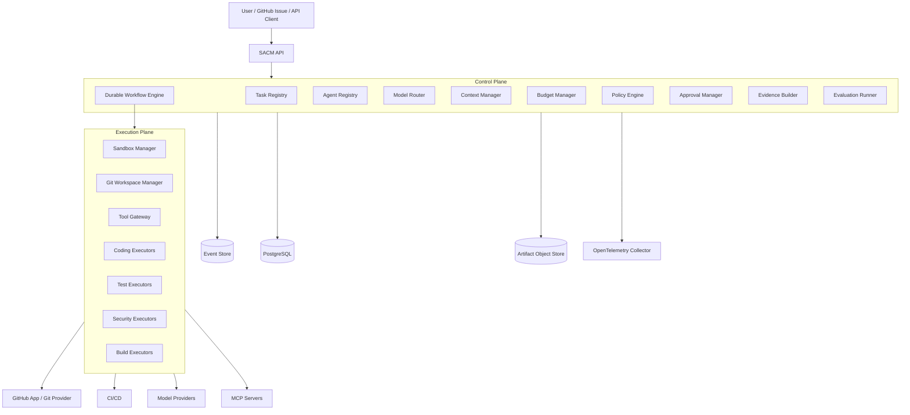
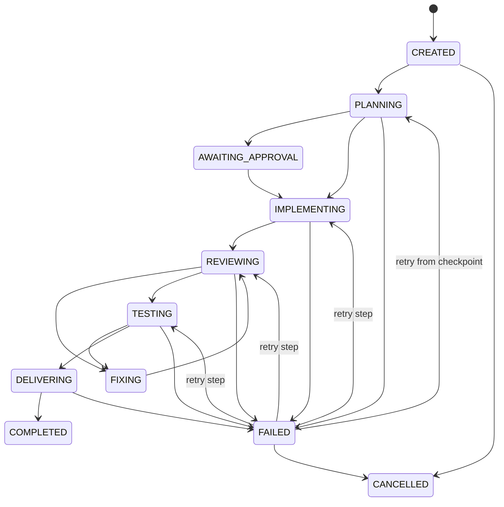
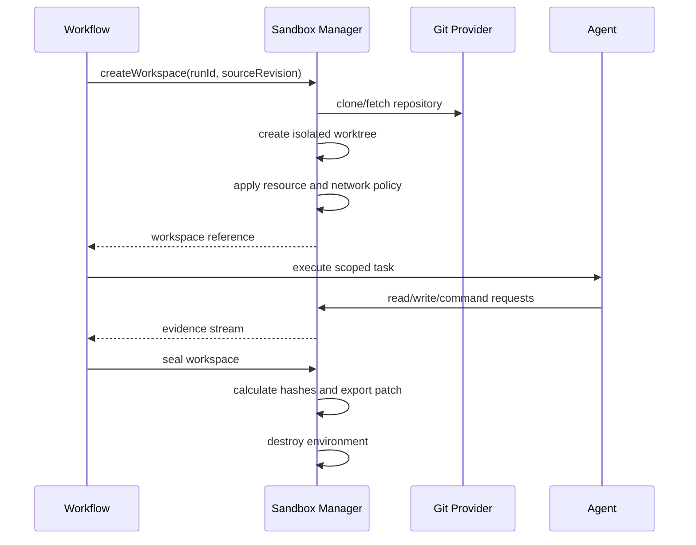

# SACM Agent Runtime — Product Maturity Upgrade Plan

> **Document status:** Implementation blueprint  
> **Target repository:** `sacm-agent-runtime`  
> **Target outcome:** Production-ready, evidence-driven software delivery runtime  
> **Primary release target:** `v1.0.0`  
> **Last updated:** 2026-07-27

---

## 1. Purpose

This document defines the technical and product work required to evolve SACM from a working multi-agent orchestration prototype into a mature product that can safely operate on real software repositories.

The target product is not another generic agent framework.

SACM should become:

> **An evidence-driven software delivery runtime that converts engineering requirements into verified pull requests, test results, security findings, build artifacts, and auditable execution evidence.**

A successful SACM run must produce more than an LLM response. It should produce a reproducible software delivery result.

### Required inputs

- repository reference;
- issue, task, or engineering requirement;
- acceptance criteria;
- organizational policies;
- model and cost constraints;
- execution environment configuration;
- approval requirements.

### Required outputs

- approved implementation plan;
- isolated workspace;
- source-code patch;
- independent review findings;
- executed test evidence;
- security scan results;
- pull request or commit reference;
- cost and token report;
- execution trace;
- provenance and audit package.

---

## 2. Current Product Hypothesis

The current SACM workflow appears to follow a role-oriented delivery process:

```text
Requirement
   ↓
Reasoner
   ↓
Coder
   ↓
Reviewer
   ↓
Tester
   ↓
Delivery report
```

This is a strong foundation, but production maturity requires additional guarantees:

1. execution survives process and infrastructure failures;
2. every action is authorized and auditable;
3. code executes inside an isolated environment;
4. agent communication uses validated contracts;
5. success is determined by external evidence, not agent self-assessment;
6. cost, quality, and latency are measured per run;
7. Git operations are safe and reversible;
8. the runtime supports cancellation, retry, resume, and replay;
9. enterprise customers can keep source code and secrets inside their own environment;
10. benchmark results are reproducible.

---

## 3. Product Positioning

### Recommended positioning

> **SACM is a multi-agent software delivery control plane for verified, policy-governed, and cost-efficient changes to existing codebases.**

### SACM should own

These capabilities should become the core intellectual property of the product:

- software-delivery task decomposition;
- agent-role contracts;
- context selection and context minimization;
- model routing by role and risk;
- token and cost budgeting;
- independent review and testing gates;
- evidence-based completion;
- policy-aware workflow decisions;
- failure recovery strategy;
- evaluation of cost per accepted change;
- orchestration of external coding executors.

### SACM should integrate rather than rebuild

Avoid rebuilding mature infrastructure unless there is a clear product advantage:

- workflow persistence: Temporal or an equivalent durable engine;
- telemetry: OpenTelemetry;
- policy evaluation: Open Policy Agent;
- container isolation: Docker with gVisor initially;
- supply-chain metadata: SLSA-compatible provenance and SPDX/CycloneDX SBOM;
- repository workflow: GitHub App and GitHub Actions;
- static security analysis: CodeQL, Semgrep, or both;
- dependency security: Dependabot and dependency review;
- artifact storage: S3-compatible object storage;
- relational state: PostgreSQL.

---

## 4. Product Maturity Principles

All implementation decisions should follow these principles.

### 4.1 Evidence over claims

An agent saying that tests passed is not evidence.

Evidence is:

- captured command;
- exit code;
- stdout and stderr;
- test result file;
- environment fingerprint;
- source commit;
- generated artifact hash.

### 4.2 Durable state over in-memory coordination

Every meaningful state transition must be persisted before the next action begins.

### 4.3 Least privilege by default

Agents receive only the tools, files, network destinations, secrets, and permissions required by their current step.

### 4.4 Independent verification

The agent that creates a change must not be the sole authority deciding whether the change is correct.

### 4.5 Structured contracts over free-form handoffs

Agent-to-agent communication must use versioned schemas.

### 4.6 Idempotency over optimistic retries

Every retried operation must either:

- produce the same result safely; or
- detect that the result already exists.

### 4.7 Human control for irreversible actions

Merging, publishing, releasing, modifying infrastructure, or accessing sensitive systems must be governed by explicit policy.

### 4.8 Cost per accepted result

The primary efficiency metric is:

```text
total execution cost / accepted pull requests
```

Token count alone is a supporting metric, not the product outcome.

---

## 5. Target Architecture



### 5.1 Control plane responsibilities

- own run state;
- schedule steps;
- enforce workflow rules;
- evaluate policies;
- request approvals;
- assign models and executors;
- enforce budgets;
- aggregate evidence;
- expose APIs and UI;
- retain audit records.

### 5.2 Execution plane responsibilities

- clone and prepare repositories;
- create isolated workspaces;
- execute tools and commands;
- edit files;
- run tests and builds;
- produce artifacts;
- stream execution events;
- destroy temporary environments.

### 5.3 Trust boundary

The control plane must never assume that:

- repository content is safe;
- generated shell commands are safe;
- tool output is truthful;
- an LLM-generated success statement is correct;
- external MCP servers are trusted;
- a build artifact corresponds to the expected source unless provenance is verified.

---

## 6. Canonical Domain Model

Introduce a stable domain model before adding more agent roles.

### 6.1 Main entities

```text
Organization
Project
Repository
Run
Step
AgentInvocation
ToolInvocation
Workspace
Artifact
Evidence
Approval
PolicyDecision
UsageRecord
Evaluation
```

### 6.2 Run state machine



### 6.3 Minimum run record

```typescript
export type RunStatus =
  | 'CREATED'
  | 'PLANNING'
  | 'AWAITING_APPROVAL'
  | 'IMPLEMENTING'
  | 'REVIEWING'
  | 'FIXING'
  | 'TESTING'
  | 'DELIVERING'
  | 'COMPLETED'
  | 'FAILED'
  | 'CANCELLED';

export interface RunRecord {
  id: string;
  organizationId: string;
  projectId: string;
  repositoryId: string;
  sourceRevision: string;
  status: RunStatus;
  workflowVersion: string;
  policySetVersion: string;
  inputArtifactId: string;
  createdAt: string;
  updatedAt: string;
  startedAt?: string;
  completedAt?: string;
  cancelledAt?: string;
  failure?: StructuredFailure;
  budget: RunBudget;
  usage: RunUsage;
}
```

### 6.4 State-transition rule

A state transition must be committed atomically with the event that caused it.

Example:

```text
append StepCompleted event
update step status
update run status
store output artifact references
```

These operations must be part of one transaction or an equivalent transactional outbox pattern.

---

## 7. Versioned Agent Contracts

Replace free-form role handoffs with versioned schemas.

### 7.1 Agent task contract

```typescript
export interface AgentTaskV1 {
  schemaVersion: 'agent-task/v1';
  runId: string;
  stepId: string;
  role: 'reasoner' | 'coder' | 'reviewer' | 'tester' | 'security';
  objective: string;
  acceptanceCriteria: AcceptanceCriterion[];
  repository: RepositoryContext;
  contextReferences: ContextReference[];
  allowedTools: ToolPermission[];
  deniedTools: ToolDenial[];
  fileScope?: FileScope;
  networkPolicy: NetworkPolicy;
  tokenBudget: number;
  costBudgetUsd?: number;
  timeoutSeconds: number;
  retryPolicy: RetryPolicy;
  outputSchema: string;
}
```

### 7.2 Agent result contract

```typescript
export interface AgentResultV1 {
  schemaVersion: 'agent-result/v1';
  runId: string;
  stepId: string;
  status: 'COMPLETED' | 'FAILED' | 'NEEDS_APPROVAL';
  summary: string;
  artifacts: ArtifactReference[];
  evidence: EvidenceReference[];
  decisions: DecisionRecord[];
  findings: Finding[];
  usage: UsageRecord;
  failure?: StructuredFailure;
}
```

### 7.3 Required role outputs

| Role | Required output |
|---|---|
| Reasoner | `implementation-plan.json` |
| Coder | `patch.diff`, `change-manifest.json` |
| Reviewer | `review-report.json` |
| Tester | `test-plan.json`, `test-results.xml`, `test-summary.json` |
| Security | `security-findings.sarif` |
| Delivery | `delivery-manifest.json`, PR reference |
| Evidence builder | `run-manifest.json`, checksums, provenance |

### 7.4 Schema rules

- validate every input and output;
- reject unknown mandatory fields only on major versions;
- persist the exact schema version;
- preserve original model output for debugging;
- never let downstream steps consume unvalidated free-form data;
- add migration utilities for stored contracts.

### 7.5 Definition of done

- [ ] All built-in agents consume `AgentTaskV1`.
- [ ] All built-in agents return `AgentResultV1`.
- [ ] JSON Schema or Zod validation is enforced.
- [ ] Invalid agent output fails predictably.
- [ ] Contract compatibility tests exist.
- [ ] Stored runs can be replayed after a minor product upgrade.

---

## 8. Durable Workflow Execution

### 8.1 Recommended implementation

Use Temporal as the production workflow engine unless the existing runtime already provides equivalent guarantees.

Suggested mapping:

```text
SACM Run       → Temporal Workflow
SACM Step      → Temporal Activity or child workflow
Agent call     → Activity
Tool call      → Activity
Approval wait  → Signal
Cancellation   → Workflow cancellation
Resume         → Native workflow recovery
Timeout        → Activity/workflow timeout
```

### 8.2 Workflow requirements

- deterministic orchestration code;
- persistent history;
- automatic worker recovery;
- activity retries;
- heartbeat for long-running commands;
- cancellation propagation;
- approval signals;
- child workflows for parallel work;
- workflow versioning;
- explicit compensation for side effects.

### 8.3 Idempotency keys

Every side-effecting operation must use a stable idempotency key.

Examples:

```text
clone repository:         runId + repositoryId + sourceRevision
create branch:            runId + branchPurpose
push commit:              runId + commitSequence
create pull request:      runId + repositoryId
upload artifact:          runId + artifactType + sha256
request approval:         runId + stepId + policyDecisionId
```

### 8.4 Recovery scenarios that must be tested

- [ ] Control plane process dies during planning.
- [ ] Worker dies while a model request is running.
- [ ] Worker dies after command completion but before result persistence.
- [ ] GitHub accepts PR creation but the response is lost.
- [ ] Artifact upload succeeds but confirmation is lost.
- [ ] User cancels during a long test suite.
- [ ] Approval arrives after a workflow restart.
- [ ] Model provider returns timeout or rate limit.
- [ ] Database becomes temporarily unavailable.
- [ ] The same event is delivered more than once.

### 8.5 Definition of done

- [ ] A run resumes after control-plane restart.
- [ ] A run resumes after worker restart.
- [ ] Retried activities do not duplicate branches, commits, PRs, or artifacts.
- [ ] `sacm run inspect` shows the current durable state.
- [ ] `sacm run cancel` propagates to active work.
- [ ] `sacm run retry --step <id>` retries only the selected failed step.
- [ ] Workflow history remains readable across supported product versions.

---

## 9. Event Log and Audit Model

Every important event must be immutable and append-only.

### 9.1 Minimum event envelope

```typescript
export interface RuntimeEvent<TPayload = unknown> {
  eventId: string;
  eventType: string;
  eventVersion: number;
  runId: string;
  stepId?: string;
  sequence: number;
  occurredAt: string;
  actor: EventActor;
  correlationId: string;
  causationId?: string;
  payload: TPayload;
  previousEventHash?: string;
  eventHash: string;
}
```

### 9.2 Recommended event types

```text
RunCreated
RunStarted
RunCancelled
RunCompleted
RunFailed

StepScheduled
StepStarted
StepCompleted
StepFailed
StepRetryScheduled

AgentAssigned
AgentInvocationStarted
AgentInvocationCompleted
AgentInvocationFailed

ToolPermissionEvaluated
ToolInvocationRequested
ToolInvocationApproved
ToolInvocationDenied
ToolInvocationStarted
ToolInvocationCompleted
ToolInvocationFailed

WorkspaceCreated
WorkspaceDestroyed

ArtifactProduced
ArtifactUploaded
ArtifactVerified

ApprovalRequested
ApprovalGranted
ApprovalRejected
ApprovalExpired

PolicyEvaluated
BudgetWarningRaised
BudgetExceeded
```

### 9.3 Tamper evidence

For enterprise auditability:

- hash-chain the ordered events for each run;
- periodically sign run summaries;
- include the final event-chain hash in `run-manifest.json`;
- optionally store final hashes in an external immutable ledger.

Blockchain anchoring is optional. Cryptographic integrity and external signatures are sufficient for the first production release.

---

## 10. Isolated Workspace and Sandbox

### 10.1 Workspace lifecycle



### 10.2 Minimum isolation for beta

- Docker container per run or isolated step;
- non-root user;
- read-only base image;
- writable mounted workspace only;
- disabled privileged mode;
- dropped Linux capabilities;
- CPU and memory limits;
- PID limit;
- execution timeout;
- restricted filesystem mounts;
- no Docker socket;
- no host SSH agent;
- no implicit cloud metadata access;
- network denied by default;
- explicit destination allowlist;
- command and file-operation audit.

### 10.3 Recommended production isolation

- gVisor runtime for untrusted code;
- Kubernetes jobs or equivalent worker scheduler;
- separate execution namespaces;
- workload identity;
- short-lived credentials;
- dedicated node pools for high-risk execution;
- optional Firecracker-based executor for higher isolation.

### 10.4 Workspace manager interface

```typescript
export interface WorkspaceManager {
  create(input: CreateWorkspaceInput): Promise<WorkspaceRef>;
  execute(input: ExecuteCommandInput): Promise<CommandResult>;
  readFile(input: ReadFileInput): Promise<FileReadResult>;
  writeFile(input: WriteFileInput): Promise<FileWriteResult>;
  createPatch(workspaceId: string): Promise<ArtifactReference>;
  snapshot(workspaceId: string): Promise<WorkspaceSnapshot>;
  restore(snapshotId: string): Promise<WorkspaceRef>;
  destroy(workspaceId: string): Promise<void>;
}
```

### 10.5 Definition of done

- [ ] Each run receives an isolated workspace.
- [ ] A run cannot read another run's workspace.
- [ ] Containers cannot access host secrets.
- [ ] Network access is denied unless explicitly permitted.
- [ ] All commands include exit code, timestamps, stdout, and stderr.
- [ ] Every changed file is listed in a change manifest.
- [ ] Workspace destruction is verified.
- [ ] Security tests attempt and fail to escape the sandbox.

---

## 11. Repository and Git Safety

### 11.1 Git rules

- never write directly to the default branch;
- create one branch per run;
- use deterministic branch naming;
- use Git worktrees for parallel agents;
- protect against uncommitted user changes;
- verify source revision before delivery;
- rebase or update before final verification;
- detect semantic conflicts, not only textual conflicts;
- sign commits when configured;
- preserve authorship metadata.

Suggested branch format:

```text
sacm/<run-short-id>/<task-slug>
```

### 11.2 Parallel-agent ownership

Every parallel implementation task must declare:

```typescript
export interface WorkPartition {
  taskId: string;
  ownedPaths: string[];
  sharedPaths: string[];
  dependencies: string[];
  mergeOrder: number;
}
```

Before parallel execution:

- detect overlapping owned paths;
- serialize changes to shared configuration files;
- assign an integration agent or deterministic merge step;
- run tests only after integrated patch creation.

### 11.3 Pull request policy

SACM may:

- create a branch;
- push commits to its branch;
- create or update a draft pull request;
- comment with evidence;
- respond to review findings.

SACM must not merge unless:

- organization policy explicitly permits it;
- required checks pass;
- required approvals exist;
- source revision is current;
- no unresolved critical findings remain.

---

## 12. GitHub App Integration

The first production integration should be a GitHub App.

### 12.1 Trigger flow

```text
Issue created or labeled `sacm`
    ↓
Webhook validates installation and repository policy
    ↓
SACM creates a run
    ↓
Reasoner posts implementation plan
    ↓
Optional approval
    ↓
SACM creates branch and draft PR
    ↓
Implementation, review, tests, security
    ↓
PR updated with evidence summary
    ↓
Human review and merge
```

### 12.2 Minimum permissions

Prefer repository-scoped, least-privilege permissions.

Likely requirements:

- metadata: read;
- contents: read/write on SACM branches;
- issues: read/write;
- pull requests: read/write;
- checks: read/write;
- actions: read;
- commit statuses: read/write.

Do not request administration permissions for the beta unless absolutely required.

### 12.3 Webhook requirements

- validate signatures;
- persist webhook delivery ID;
- deduplicate deliveries;
- process asynchronously;
- return quickly;
- retry safely;
- retain raw payload according to data-retention policy;
- redact secrets before logging.

### 12.4 Required commands

Support issue or PR comments such as:

```text
/sacm plan
/sacm start
/sacm status
/sacm stop
/sacm retry
/sacm explain
/sacm evidence
```

All commands must be authorization-checked against organization policy.

---

## 13. Policy Engine and Human Approval

### 13.1 Policy layers

Evaluate policies at four levels:

1. global SACM defaults;
2. organization;
3. repository;
4. run override approved by an authorized user.

### 13.2 Policy input

```json
{
  "actor": {
    "type": "agent",
    "role": "coder",
    "trustLevel": "standard"
  },
  "action": {
    "type": "tool.execute",
    "tool": "shell",
    "commandCategory": "dependency-install"
  },
  "resource": {
    "organizationId": "org-1",
    "repository": "owner/repo",
    "branch": "sacm/abc/task"
  },
  "context": {
    "runId": "run-123",
    "environment": "sandbox",
    "riskScore": 0.62
  }
}
```

### 13.3 Action classes

| Class | Examples | Default |
|---|---|---|
| Safe | read repository file, run approved test | automatic |
| Controlled | install dependency, external network call, push branch | policy-dependent |
| Critical | merge, publish package, deploy, modify infrastructure | human approval |

### 13.4 Initial approval gates

Require approval for:

- changing CI/CD workflow files;
- modifying infrastructure-as-code;
- adding or upgrading production dependencies;
- changing database migrations;
- accessing external network destinations outside allowlist;
- accessing protected secrets;
- pushing to a non-SACM branch;
- merging;
- creating a production release;
- deploying.

### 13.5 Policy-as-code

Use Open Policy Agent or an equivalent engine.

Store policy decisions as evidence:

```text
policy ID
policy version
input hash
decision
reason
timestamp
approver, when applicable
```

### 13.6 Definition of done

- [ ] Every tool action is evaluated before execution.
- [ ] Denied actions cannot bypass the gateway.
- [ ] Approval waits survive process restarts.
- [ ] Approval links expire.
- [ ] Approvers are authorization-checked.
- [ ] Policy version is stored with each decision.
- [ ] Critical actions cannot be executed by prompt injection.

---

## 14. Tool Gateway

All tools must be accessed through one controlled gateway.

### 14.1 Responsibilities

- schema validation;
- authorization;
- policy evaluation;
- rate limiting;
- timeout;
- retries where safe;
- secret injection;
- output redaction;
- evidence capture;
- telemetry;
- circuit breaking;
- tool health monitoring.

### 14.2 Tool descriptor

```typescript
export interface ToolDescriptor {
  id: string;
  version: string;
  description: string;
  inputSchema: object;
  outputSchema: object;
  riskClass: 'SAFE' | 'CONTROLLED' | 'CRITICAL';
  idempotency: 'IDEMPOTENT' | 'REQUIRES_KEY' | 'NON_IDEMPOTENT';
  defaultTimeoutSeconds: number;
  requiredCapabilities: string[];
}
```

### 14.3 MCP support

MCP servers must be treated as third-party integrations.

For each MCP server:

- pin server version;
- validate tool schemas;
- maintain an allowlist;
- define network policy;
- classify risk;
- record server identity;
- enforce timeouts;
- redact tool output;
- block dynamic tool registration unless approved.

---

## 15. Secret Management

### 15.1 Rules

- secrets are never placed in prompts;
- secrets are never stored in run artifacts;
- model providers never receive repository credentials;
- execution receives short-lived scoped credentials;
- logs are scanned and redacted;
- secret access requires policy evaluation;
- secret use is recorded without storing the secret.

### 15.2 Secret broker interface

```typescript
export interface SecretBroker {
  issue(input: SecretRequest): Promise<ShortLivedCredential>;
  revoke(credentialId: string): Promise<void>;
  audit(requestId: string): Promise<SecretAccessRecord>;
}
```

### 15.3 Supported backends

Start with:

- environment-backed local development adapter;
- HashiCorp Vault or cloud-native secret manager for production.

### 15.4 Security tests

- [ ] Prompt asks agent to print credentials.
- [ ] Repository contains fake `.env` secrets.
- [ ] Command attempts to read host environment.
- [ ] Tool output contains a known canary secret.
- [ ] Agent attempts to send secret to an external endpoint.
- [ ] Evidence builder attempts to package a secret-bearing file.

Every scenario must result in denial or redaction.

---

## 16. Model Router

### 16.1 Routing dimensions

Choose models based on:

- task type;
- repository language;
- context size;
- risk;
- required tool use;
- latency target;
- budget;
- historical success rate;
- data residency requirement;
- customer allowlist.

### 16.2 Suggested role strategy

```text
Repository classifier  → low-cost model
Context selector       → low-cost model plus deterministic search
Reasoner               → strong reasoning model
Coder                  → coding-specialized model or executor
Reviewer               → independent model family where possible
Tester                 → coding model with test-generation profile
Summarizer             → low-cost model
```

### 16.3 Fallback rules

- provider timeout → retry with bounded backoff;
- repeated timeout → route to compatible fallback;
- invalid structured output → repair once, then fallback;
- budget threshold → request approval or use lower-cost model;
- policy restriction → never route to disallowed provider.

### 16.4 Avoid false savings

Do not reduce token use by removing necessary evidence or verification.

Optimize:

```text
cost per accepted change
```

not:

```text
minimum tokens per run
```

---

## 17. Context Manager

Context quality is likely to become one of SACM's strongest differentiators.

### 17.1 Context pipeline

```text
Repository inventory
    ↓
Language/framework detection
    ↓
Dependency and architecture graph
    ↓
Task-to-file relevance search
    ↓
Symbol-level extraction
    ↓
Role-specific context package
    ↓
Budget-aware compression
```

### 17.2 Role-specific packages

#### Reasoner

- requirement;
- acceptance criteria;
- repository map;
- architecture documents;
- affected modules;
- dependency graph;
- constraints and policies.

#### Coder

- approved plan;
- relevant source files;
- interfaces and contracts;
- existing tests;
- build instructions;
- file scope;
- prohibited actions.

#### Reviewer

- requirement;
- acceptance criteria;
- approved plan;
- final diff;
- affected contracts;
- test evidence;
- architecture constraints.

#### Tester

- acceptance criteria;
- public behavior;
- final diff;
- test framework;
- existing fixtures;
- known edge cases;
- environment definition.

### 17.3 Context provenance

Every context fragment must store:

- source artifact;
- source revision;
- path or symbol;
- extraction method;
- hash;
- relevance score;
- consuming agent;
- token count.

### 17.4 Context-cache safety

Cache keys must include:

```text
repository ID
source revision
path or symbol
extractor version
embedding/model version
policy scope
```

Never reuse cached private-repository context across organizations.

---

## 18. Independent Review and Quality Gates

### 18.1 Review categories

The Reviewer must check:

- requirement coverage;
- correctness;
- backward compatibility;
- API changes;
- data migration risk;
- concurrency;
- error handling;
- observability;
- security;
- performance;
- maintainability;
- test adequacy;
- documentation.

### 18.2 Finding schema

```typescript
export interface Finding {
  id: string;
  category: string;
  severity: 'INFO' | 'LOW' | 'MEDIUM' | 'HIGH' | 'CRITICAL';
  confidence: number;
  title: string;
  description: string;
  file?: string;
  lineStart?: number;
  lineEnd?: number;
  evidence: EvidenceReference[];
  remediation?: string;
  blocksDelivery: boolean;
}
```

### 18.3 Review independence

The reviewer should preferably:

- use a different prompt profile;
- receive only final artifacts, not the coder's chain of reasoning;
- use another model family for high-risk changes;
- be unable to silently edit code;
- emit findings before any fix cycle begins.

### 18.4 Delivery gate

Delivery is blocked when:

- any critical finding remains open;
- high findings exceed policy threshold;
- required tests are missing;
- source revision changed and revalidation was not performed;
- budget exceeded without approval;
- required evidence is incomplete.

---

## 19. Testing Architecture

### 19.1 Test layers

#### Runtime tests

- state machine;
- event ordering;
- idempotency;
- retries;
- cancellation;
- workflow replay;
- policy enforcement;
- budget enforcement.

#### Agent contract tests

- valid output;
- invalid output;
- schema migration;
- missing evidence;
- contradictory result;
- hallucinated tool result.

#### Integration tests

- GitHub App;
- model providers;
- artifact store;
- PostgreSQL;
- workflow engine;
- sandbox;
- OpenTelemetry;
- policy engine.

#### End-to-end tests

```text
issue → plan → approval → branch → patch → review → tests → PR
```

#### Adversarial tests

- prompt injection in source code;
- malicious README instructions;
- dependency confusion attempt;
- secret exfiltration;
- infinite command;
- fork bomb;
- huge output;
- symlink traversal;
- network bypass;
- workspace escape.

### 19.2 Test-result evidence

Prefer standard formats:

- JUnit XML;
- LCOV/Cobertura coverage;
- SARIF security findings;
- JSON summary;
- command logs with hashes.

### 19.3 Flaky test handling

SACM must distinguish:

- deterministic failure;
- infrastructure failure;
- flaky test;
- policy denial;
- model failure.

Retries must not automatically hide flaky tests.

### 19.4 Definition of done

- [ ] Core runtime unit coverage is at least 80%.
- [ ] Critical state and policy code uses branch coverage.
- [ ] End-to-end happy path runs in CI.
- [ ] Failure-recovery E2E runs in CI.
- [ ] Sandbox adversarial suite runs on release candidates.
- [ ] Test evidence is attached to every completed delivery run.

---

## 20. Security Pipeline

Every delivered patch should pass configurable security checks.

### 20.1 Default pipeline

```text
secret scan
    ↓
dependency review
    ↓
static analysis
    ↓
license policy
    ↓
SBOM generation
    ↓
container scan, when applicable
    ↓
provenance generation
```

### 20.2 Recommended integrations

- CodeQL;
- Semgrep;
- Gitleaks or equivalent secret scanner;
- Dependabot/dependency review;
- Trivy or Grype for images;
- Syft for SBOM;
- Cosign for signing;
- SPDX or CycloneDX format.

### 20.3 Security release gate

A release must fail if:

- a critical vulnerability is introduced;
- a secret is detected;
- an unapproved license is introduced;
- artifact signature is missing when required;
- provenance cannot be generated;
- the build source does not match the expected commit.

---

## 21. Evidence Pack

Each run must produce an immutable evidence package.

### 21.1 Directory layout

```text
evidence/
├── run-manifest.json
├── request.json
├── acceptance-criteria.json
├── repository-manifest.json
├── approved-plan.json
├── context-manifest.json
├── agent-invocations.jsonl
├── tool-invocations.jsonl
├── policy-decisions.jsonl
├── approvals.jsonl
├── commands.jsonl
├── patch.diff
├── change-manifest.json
├── review-report.json
├── test-results.xml
├── test-summary.json
├── coverage.json
├── security-findings.sarif
├── sbom.spdx.json
├── model-usage.json
├── cost-report.json
├── delivery-manifest.json
├── provenance.intoto.jsonl
├── checksums.sha256
└── signature.sig
```

### 21.2 Run manifest

```json
{
  "schemaVersion": "run-manifest/v1",
  "runId": "run-123",
  "workflowVersion": "1.0.0",
  "sourceRevision": "abc123",
  "resultRevision": "def456",
  "status": "COMPLETED",
  "eventChainHash": "sha256:...",
  "artifactCount": 18,
  "startedAt": "2026-07-27T10:00:00Z",
  "completedAt": "2026-07-27T10:41:00Z"
}
```

### 21.3 Completion rule

A run cannot be marked `COMPLETED` until:

- mandatory artifacts exist;
- artifact hashes verify;
- required approvals exist;
- required quality gates pass;
- delivery target exists;
- final source and result revisions are recorded.

---

## 22. Observability

Use OpenTelemetry for traces, metrics, and logs.

### 22.1 Trace structure

```text
sacm.run
├── repository.prepare
├── context.build
├── workflow.plan
│   └── model.invoke
├── workflow.implement
│   ├── model.invoke
│   ├── workspace.file.write
│   └── workspace.command.execute
├── workflow.review
├── workflow.test
├── workflow.security
├── github.pull_request.create
└── evidence.package
```

### 22.2 Required metrics

#### Reliability

- run success rate;
- infrastructure failure rate;
- retry count;
- recovery success rate;
- cancellation latency;
- queue time;
- worker saturation.

#### Quality

- accepted PR rate;
- first-pass acceptance rate;
- reviewer finding rate;
- post-merge regression rate;
- test pass rate;
- unresolved high-severity finding rate.

#### Efficiency

- total run duration;
- active execution duration;
- human minutes per task;
- tokens by role;
- model cost by role;
- tool cost;
- cost per accepted PR;
- cache hit rate.

#### Security

- denied tool requests;
- secret redactions;
- sandbox violations;
- policy overrides;
- critical findings;
- unauthorized approval attempts.

### 22.3 Logging rules

- structured JSON;
- correlation IDs;
- no raw secrets;
- no full private source files by default;
- configurable retention;
- immutable audit stream for enterprise;
- separate user-visible logs from restricted security logs.

---

## 23. Budget Manager

### 23.1 Budget types

- token budget;
- model-cost budget;
- wall-clock budget;
- tool-call budget;
- retry budget;
- human-approval timeout;
- storage budget.

### 23.2 Budget behavior

At 70%:

- emit warning;
- enable context compression;
- stop low-value exploratory calls.

At 90%:

- require explicit justification for additional expensive calls;
- prefer cheaper compatible model when policy permits.

At 100%:

- pause and request approval; or
- fail with `BUDGET_EXCEEDED` according to policy.

### 23.3 Usage attribution

Attribute every cost to:

```text
organization
project
repository
run
step
role
model
tool
```

---

## 24. Evaluation Framework

A mature product must prove its quality.

### 24.1 Evaluation sets

Build three evaluation sets.

#### Public benchmark

Use an appropriate subset of SWE-bench Verified or another reproducible software-engineering benchmark.

#### Internal benchmark

Create 50–100 tasks across:

- TypeScript;
- Python;
- Java;
- React/React Native;
- backend APIs;
- dependency updates;
- bug fixes;
- feature implementation;
- refactoring;
- security fixes;
- infrastructure changes.

#### Customer pilot tasks

Use real customer tasks after anonymization and explicit permission.

### 24.2 Experiment variants

For every benchmark task compare:

```text
A: single coding agent
B: SACM without independent reviewer
C: SACM without independent tester
D: complete SACM
E: complete SACM with model routing
```

### 24.3 Core metrics

- resolved-task rate;
- tests passed;
- regression rate;
- accepted patch rate;
- cost per accepted patch;
- total duration;
- human intervention time;
- number of fix cycles;
- security finding rate;
- result reproducibility.

### 24.4 Reporting rules

Do not compare:

- actual SACM token usage against an estimated manual baseline without labeling it;
- different models without controlling model costs;
- different time limits without disclosure;
- documented test cases with executed tests;
- self-reported success with evaluator-confirmed success.

### 24.5 Statistical requirements

For product claims:

- publish sample size;
- publish task-selection rules;
- publish model and configuration;
- report median and percentile values;
- report confidence intervals where meaningful;
- retain raw evaluator evidence;
- rerun a sample to measure variance.

---

## 25. CLI

The CLI should be the first complete user interface.

### 25.1 Required commands

```bash
sacm init
sacm doctor
sacm config validate

sacm run create --repository . --task issue.md
sacm run list
sacm run inspect <run-id>
sacm run logs <run-id>
sacm run trace <run-id>
sacm run approve <run-id> <approval-id>
sacm run reject <run-id> <approval-id>
sacm run cancel <run-id>
sacm run retry <run-id> --step <step-id>
sacm run resume <run-id>
sacm run evidence <run-id> --output ./evidence.zip

sacm benchmark run <suite>
sacm benchmark compare <experiment-a> <experiment-b>
```

### 25.2 CLI requirements

- machine-readable JSON output;
- clear exit codes;
- non-interactive CI mode;
- streaming progress;
- no secret output;
- local and remote control-plane support;
- shell completion;
- version compatibility checks.

---

## 26. REST API

### 26.1 Initial endpoints

```text
POST   /v1/runs
GET    /v1/runs
GET    /v1/runs/{runId}
POST   /v1/runs/{runId}/cancel
POST   /v1/runs/{runId}/retry
POST   /v1/runs/{runId}/resume
GET    /v1/runs/{runId}/events
GET    /v1/runs/{runId}/artifacts
GET    /v1/runs/{runId}/evidence

GET    /v1/approvals
POST   /v1/approvals/{approvalId}/approve
POST   /v1/approvals/{approvalId}/reject

GET    /v1/policies
POST   /v1/policies/validate

GET    /v1/models
GET    /v1/tools
GET    /v1/health
GET    /v1/ready
```

### 26.2 API rules

- OpenAPI specification;
- stable versioning;
- idempotency keys for POST operations;
- pagination;
- correlation IDs;
- explicit error schema;
- rate limiting;
- authentication and authorization;
- audit every write;
- no sensitive data in URLs.

---

## 27. Deployment Models

### 27.1 Local Developer Edition

Use for individual developers and evaluation.

```text
CLI
local control plane
SQLite or local PostgreSQL
Docker sandbox
user-provided model keys
local artifact directory
```

### 27.2 Team SaaS

```text
SACM-hosted control plane
GitHub App
managed PostgreSQL
managed object storage
managed workflow engine
isolated hosted executors
usage metering
team dashboard
```

### 27.3 Enterprise Hybrid

Recommended enterprise architecture:

```text
SACM SaaS control plane
        │
        │ outbound mutually authenticated channel
        ▼
customer-hosted execution plane
inside customer VPC
```

Source code, build artifacts, and high-sensitivity logs can remain in the customer's environment.

### 27.4 Fully self-hosted

Offer only after operational maturity.

Requirements:

- Helm chart or supported deployment bundle;
- upgrade procedure;
- backup and restore;
- observability integration;
- license management;
- compatibility matrix;
- air-gapped installation strategy;
- support runbooks.

---

## 28. Identity, Tenancy, and RBAC

### 28.1 Tenant hierarchy

```text
Organization
└── Projects
    └── Repositories
        └── Runs
```

### 28.2 Initial roles

- Organization Owner;
- Administrator;
- Security Administrator;
- Developer;
- Approver;
- Auditor;
- Viewer;
- Service Account.

### 28.3 Authorization checks

Check permissions for:

- starting a run;
- viewing source-derived artifacts;
- approving an action;
- changing policies;
- changing model providers;
- accessing cost information;
- downloading evidence;
- cancelling or retrying runs;
- configuring Git installations.

### 28.4 Enterprise requirements

- SSO/SAML;
- SCIM;
- service accounts;
- API tokens with scopes;
- session revocation;
- audit logs;
- retention policies;
- regional data controls.

---

## 29. Data Retention and Privacy

Classify data:

| Class | Examples |
|---|---|
| Public | open-source repository metadata |
| Internal | task descriptions, operational metrics |
| Confidential | private source-derived context, patches |
| Restricted | secrets, credentials, regulated data |

Policies must control:

- prompt retention;
- source-derived artifact retention;
- execution logs;
- model-provider data usage;
- deletion;
- export;
- regional storage;
- evidence retention.

Never retain full source files when a symbol-level reference and hash are sufficient.

---

## 30. Recommended Repository Structure

Adapt names to the current implementation, but aim for clear module boundaries.

```text
sacm-agent-runtime/
├── apps/
│   ├── api/
│   ├── cli/
│   ├── worker/
│   └── dashboard/
├── packages/
│   ├── contracts/
│   ├── domain/
│   ├── workflow/
│   ├── agents/
│   ├── model-router/
│   ├── context-manager/
│   ├── budget-manager/
│   ├── policy-engine/
│   ├── approval-manager/
│   ├── tool-gateway/
│   ├── workspace/
│   ├── github/
│   ├── evidence/
│   ├── evaluation/
│   ├── telemetry/
│   ├── security/
│   └── testing/
├── infra/
│   ├── docker/
│   ├── kubernetes/
│   ├── temporal/
│   ├── postgres/
│   ├── otel/
│   └── policies/
├── schemas/
│   ├── agent-task/
│   ├── agent-result/
│   ├── events/
│   └── evidence/
├── benchmarks/
│   ├── suites/
│   ├── evaluators/
│   └── reports/
├── examples/
├── docs/
│   ├── architecture/
│   ├── security/
│   ├── operations/
│   ├── api/
│   └── decisions/
├── tests/
│   ├── unit/
│   ├── integration/
│   ├── e2e/
│   ├── recovery/
│   └── adversarial/
└── UPGRADE.md
```

If the repository is currently small, introduce boundaries incrementally rather than performing a disruptive monorepo rewrite.

---

## 31. Architecture Decision Records

Create ADRs before major infrastructure decisions.

Required initial ADRs:

```text
ADR-001 Product boundary and positioning
ADR-002 Durable workflow engine
ADR-003 Event store and transactional guarantees
ADR-004 Agent contract format and versioning
ADR-005 Sandbox isolation model
ADR-006 Tool gateway and policy enforcement
ADR-007 Git workspace and branch strategy
ADR-008 Evidence and provenance format
ADR-009 OpenTelemetry architecture
ADR-010 Model routing and provider abstraction
ADR-011 Multi-tenancy and data isolation
ADR-012 Hosted vs customer-hosted execution plane
```

Each ADR must contain:

- context;
- decision;
- alternatives;
- consequences;
- security implications;
- migration plan;
- rollback strategy.

---

## 32. Delivery Roadmap

## Phase 0 — Baseline and Stabilization

**Duration:** 1–2 weeks  
**Goal:** Understand and freeze the current behavior before restructuring.

### Work

- [ ] Document the current run lifecycle.
- [ ] Inventory agents, tools, models, and persistence.
- [ ] Record current public interfaces.
- [ ] Add a smoke-test workflow for the existing blockchain case study.
- [ ] Capture current token, cost, latency, and success metrics.
- [ ] Identify all side effects.
- [ ] Add basic CI: lint, type check, unit test, build.
- [ ] Add dependency and secret scanning.
- [ ] Tag the current baseline release.
- [ ] Create ADR directory.

### Exit criteria

- Existing demonstration still works from a clean checkout.
- CI runs automatically.
- Current behavior has a repeatable test.
- Baseline metrics are stored.
- A rollback tag exists.

---

## Phase 1 — Contracts and Domain Core

**Duration:** 2–3 weeks  
**Goal:** Establish stable data structures and state transitions.

### Work

- [ ] Implement canonical `Run`, `Step`, `Artifact`, `Evidence`, and `Approval`.
- [ ] Implement `AgentTaskV1` and `AgentResultV1`.
- [ ] Add schema validation.
- [ ] Add structured failures.
- [ ] Implement run state machine.
- [ ] Implement immutable runtime events.
- [ ] Add contract fixtures.
- [ ] Migrate built-in agents to contracts.
- [ ] Add compatibility tests.

### Exit criteria

- No built-in agent depends on undocumented free-form handoffs.
- Every run and step has a stable identifier.
- Every output is validated before consumption.
- State transitions are unit-tested.
- Old case-study flow runs through the new contracts.

---

## Phase 2 — Durable Execution

**Duration:** 3–4 weeks  
**Goal:** Survive infrastructure failures and support resume/retry/cancel.

### Work

- [ ] Integrate Temporal or equivalent engine.
- [ ] Convert the main SACM flow into a durable workflow.
- [ ] Convert side effects into activities.
- [ ] Add idempotency keys.
- [ ] Add retries and timeouts.
- [ ] Add cancellation propagation.
- [ ] Add approval signals.
- [ ] Add workflow versioning.
- [ ] Add recovery tests.
- [ ] Add run inspection CLI.

### Exit criteria

- Killing the control plane does not lose run state.
- Killing a worker does not duplicate delivery side effects.
- A failed step can be retried independently.
- Approval waits survive restarts.
- A cancelled run stops active execution.

---

## Phase 3 — Workspace Isolation

**Duration:** 3–4 weeks  
**Goal:** Execute repository work safely.

### Work

- [ ] Add `WorkspaceManager`.
- [ ] Create one worktree per run.
- [ ] Add Docker sandbox.
- [ ] Run as non-root.
- [ ] Add CPU, RAM, PID, and time limits.
- [ ] Deny network by default.
- [ ] Add allowed destination configuration.
- [ ] Capture commands and file changes.
- [ ] Add workspace sealing and patch export.
- [ ] Add destruction verification.
- [ ] Add sandbox adversarial tests.
- [ ] Evaluate and add gVisor.

### Exit criteria

- One run cannot access another run.
- Host credentials are inaccessible.
- Network policy is enforced.
- Every command and write is evidenced.
- Workspace escape tests fail safely.

---

## Phase 4 — GitHub Product Workflow

**Duration:** 2–4 weeks  
**Goal:** Turn issues into safe draft pull requests.

### Work

- [ ] Build GitHub App.
- [ ] Validate and deduplicate webhooks.
- [ ] Add repository installation mapping.
- [ ] Add issue-label trigger.
- [ ] Add plan comment.
- [ ] Add approval command.
- [ ] Create run branch.
- [ ] Create and update draft PR.
- [ ] Add check runs.
- [ ] Attach evidence summary.
- [ ] Handle PR review feedback.
- [ ] Add branch-protection compatibility tests.

### Exit criteria

- A labeled issue produces a draft PR.
- SACM never writes directly to the default branch.
- Duplicate webhooks do not create duplicate runs or PRs.
- Review feedback can trigger a bounded fix cycle.
- Required GitHub checks reflect actual evidence.

---

## Phase 5 — Governance and Security

**Duration:** 3–5 weeks  
**Goal:** Control every risky action.

### Work

- [ ] Introduce Tool Gateway.
- [ ] Add tool descriptors and risk classification.
- [ ] Integrate OPA.
- [ ] Add organization/repository policies.
- [ ] Add approval manager.
- [ ] Add short-lived credentials.
- [ ] Add secret redaction.
- [ ] Add CodeQL/Semgrep.
- [ ] Add dependency review.
- [ ] Add secret scan.
- [ ] Add SBOM generation.
- [ ] Add release policy.
- [ ] Add prompt-injection adversarial tests.

### Exit criteria

- Every tool call receives a policy decision.
- Critical actions require approval.
- Secrets do not appear in logs or prompts.
- Critical security findings block delivery.
- Policy and approval evidence is included in the run package.

---

## Phase 6 — Observability, Cost, and Evidence

**Duration:** 2–4 weeks  
**Goal:** Make every run measurable and auditable.

### Work

- [ ] Add OpenTelemetry tracing.
- [ ] Add structured logs.
- [ ] Add runtime metrics.
- [ ] Add model usage and price attribution.
- [ ] Add budget manager.
- [ ] Add artifact object store.
- [ ] Build evidence package.
- [ ] Add artifact hashes.
- [ ] Add event-chain hash.
- [ ] Add provenance.
- [ ] Add `sacm run evidence`.
- [ ] Add run report view.

### Exit criteria

- 100% of agent and tool calls appear in a trace.
- Every model cost is attributed to a run and role.
- Every completed run has a valid evidence package.
- Evidence hashes verify.
- Cost per accepted PR can be calculated.

---

## Phase 7 — Benchmarking and Product Proof

**Duration:** 3–6 weeks  
**Goal:** Prove that SACM improves delivery outcomes.

### Work

- [ ] Define evaluation schemas.
- [ ] Build internal benchmark suite.
- [ ] Add public benchmark adapter.
- [ ] Create deterministic environment images.
- [ ] Add single-agent baseline.
- [ ] Add SACM ablation variants.
- [ ] Automate evaluator execution.
- [ ] Generate comparison reports.
- [ ] Publish methodology.
- [ ] Recalculate blockchain case-study claims using actual telemetry.

### Exit criteria

- At least 50 reproducible tasks exist.
- SACM is compared against a controlled baseline.
- Claims include sample size and environment.
- Results measure accepted outcomes, not only token use.
- Raw evidence can be independently reviewed.

---

## Phase 8 — Team Beta

**Duration:** 4–8 weeks  
**Goal:** Support real teams and private repositories.

### Work

- [ ] Add organizations and projects.
- [ ] Add RBAC.
- [ ] Add API authentication.
- [ ] Add user and service-account audit.
- [ ] Add model-provider configuration.
- [ ] Add BYOK.
- [ ] Add quotas.
- [ ] Add retention policies.
- [ ] Add team dashboard.
- [ ] Add hosted and customer-hosted executor mode.
- [ ] Create onboarding and operational documentation.
- [ ] Run three design-partner pilots.

### Exit criteria

- Three teams use SACM on real repositories.
- No cross-tenant data leakage.
- Customers can use their own model credentials.
- Execution can run in a customer-controlled environment.
- Operational incidents have documented runbooks.

---

## Phase 9 — Enterprise Readiness

**Duration:** 3–6 months after beta validation  
**Goal:** Meet enterprise operational and security expectations.

### Work

- [ ] SSO/SAML.
- [ ] SCIM.
- [ ] Advanced RBAC.
- [ ] Regional storage controls.
- [ ] High availability.
- [ ] Backup and restore.
- [ ] Disaster-recovery testing.
- [ ] Signed releases.
- [ ] Penetration test.
- [ ] Vulnerability-management process.
- [ ] Incident-response process.
- [ ] SLA and support model.
- [ ] SOC 2 or ISO 27001 readiness, based on target customers.
- [ ] Self-hosted deployment lifecycle.

### Exit criteria

- Recovery objectives are tested.
- Security findings have an owned remediation process.
- Enterprise audit export is available.
- Deployment and rollback are documented.
- Support ownership and escalation are defined.

---

## 33. First 30 Implementation Tickets

Create these as epics/issues in the repository.

### Foundation

1. **SACM-001 — Document current runtime lifecycle**
2. **SACM-002 — Add baseline end-to-end smoke test**
3. **SACM-003 — Define canonical run and step states**
4. **SACM-004 — Add structured failure model**
5. **SACM-005 — Implement AgentTaskV1 schema**
6. **SACM-006 — Implement AgentResultV1 schema**
7. **SACM-007 — Add schema-validation middleware**
8. **SACM-008 — Migrate Reasoner to contracts**
9. **SACM-009 — Migrate Coder to contracts**
10. **SACM-010 — Migrate Reviewer and Tester to contracts**

### Durable execution

11. **SACM-011 — Create durable workflow proof of concept**
12. **SACM-012 — Add event envelope and event repository**
13. **SACM-013 — Add transactional state transition**
14. **SACM-014 — Add activity idempotency framework**
15. **SACM-015 — Add retry and timeout configuration**
16. **SACM-016 — Add cancellation propagation**
17. **SACM-017 — Add approval signal workflow**
18. **SACM-018 — Add restart and recovery E2E test**

### Execution safety

19. **SACM-019 — Implement WorkspaceManager interface**
20. **SACM-020 — Add Git worktree workspace adapter**
21. **SACM-021 — Add Docker sandbox adapter**
22. **SACM-022 — Add command evidence capture**
23. **SACM-023 — Add network-deny default**
24. **SACM-024 — Add workspace cleanup verification**
25. **SACM-025 — Add sandbox adversarial test suite**

### Product delivery

26. **SACM-026 — Create GitHub App skeleton**
27. **SACM-027 — Add webhook validation and deduplication**
28. **SACM-028 — Add branch and draft PR delivery**
29. **SACM-029 — Add OpenTelemetry run trace**
30. **SACM-030 — Generate minimal evidence pack**

---

## 34. Recommended First Vertical Slice

Do not implement all platform features simultaneously.

Build one complete, production-shaped vertical slice:

```text
GitHub issue with `sacm` label
    ↓
durable run created
    ↓
plan generated using AgentTaskV1/AgentResultV1
    ↓
approval received
    ↓
isolated Docker workspace created
    ↓
small code change produced
    ↓
tests executed
    ↓
independent review executed
    ↓
draft PR created
    ↓
evidence pack uploaded
    ↓
run marked completed
```

### Vertical-slice constraints

- one Git provider: GitHub;
- one repository at a time;
- one coding executor;
- one language initially;
- one model provider plus fallback;
- no automatic merge;
- no production deployment;
- Docker isolation first;
- local or managed PostgreSQL;
- one durable workflow.

### Vertical-slice acceptance criteria

- [ ] Run survives a control-plane restart.
- [ ] Duplicate webhook does not create duplicate run.
- [ ] Agent cannot access host filesystem.
- [ ] Agent cannot reach unapproved network destination.
- [ ] Patch is delivered only to a SACM branch.
- [ ] Tests have real exit codes and result files.
- [ ] Reviewer findings block delivery according to policy.
- [ ] Evidence package validates.
- [ ] Token and monetary cost are attributed.
- [ ] User can cancel the run.
- [ ] No secret appears in logs.

---

## 35. Definition of Done for a Production Feature

A feature is not done when code is generated.

It is done only when:

- [ ] requirements and acceptance criteria are linked;
- [ ] architecture impact is assessed;
- [ ] agent contracts are used;
- [ ] code is executed in an isolated workspace;
- [ ] unit and integration tests pass;
- [ ] failure and retry behavior is tested;
- [ ] security implications are reviewed;
- [ ] policy behavior is tested;
- [ ] telemetry is added;
- [ ] evidence is generated;
- [ ] documentation is updated;
- [ ] backward compatibility is assessed;
- [ ] migration and rollback are defined;
- [ ] CI passes from a clean environment;
- [ ] the change is reviewed by a human for critical modules.

---

## 36. Release Gates for `v1.0.0`

SACM `v1.0.0` should not be released until all P0 gates pass.

### P0 — Mandatory

- [ ] Durable runs with retry, resume, and cancel.
- [ ] Isolated workspace per run.
- [ ] No direct write to protected branches.
- [ ] Versioned agent contracts.
- [ ] Tool gateway with authorization.
- [ ] Human approval for critical actions.
- [ ] Complete execution trace.
- [ ] Evidence package per completed run.
- [ ] Cost attribution per run.
- [ ] CI, security scans, and reproducible build.
- [ ] Recovery test suite.
- [ ] Adversarial sandbox tests.
- [ ] Stable CLI and API contracts.
- [ ] Documented upgrade and rollback procedure.

### P1 — Strongly recommended

- [ ] GitHub App.
- [ ] OPA policy bundles.
- [ ] gVisor isolation.
- [ ] SBOM and provenance.
- [ ] Internal benchmark suite.
- [ ] Team RBAC.
- [ ] BYOK.
- [ ] Customer-hosted executor.

### P2 — Enterprise expansion

- [ ] SSO/SAML.
- [ ] SCIM.
- [ ] Multi-region.
- [ ] Full self-hosted deployment.
- [ ] Compliance program.
- [ ] Enterprise SLA.

---

## 37. Product KPIs

### Reliability targets

| Metric | `v1.0.0` target |
|---|---:|
| Runs recovered after worker/control-plane failure | ≥ 99% |
| Duplicate external side effects after retry | 0 |
| Infrastructure-caused failed runs | < 2% |
| Agent/tool calls represented in trace | 100% |
| Completed runs with valid evidence pack | 100% |

### Security targets

| Metric | Target |
|---|---:|
| Secrets in prompts or standard logs | 0 |
| Direct agent writes to default branch | 0 |
| Critical unmitigated release findings | 0 |
| Tool calls without policy decision | 0 |
| Cross-run workspace access | 0 |

### Product-quality targets

| Metric | Initial target |
|---|---:|
| Supported tasks ending in verifiable draft PR | ≥ 90% |
| First-pass accepted changes | Establish baseline, then improve |
| Post-merge regressions caused by SACM | < 3% |
| Evidence reproducibility | ≥ 95% |
| Core runtime unit coverage | ≥ 80% |

### Efficiency targets

Track rather than predeclare unsupported marketing claims:

- median cost per accepted PR;
- p50/p95 run duration;
- human minutes per accepted PR;
- model cost by role;
- fix-cycle count;
- context-cache hit rate;
- token use by successful vs failed run.

---

## 38. Risk Register

| Risk | Impact | Mitigation |
|---|---|---|
| More agents increase cost without improving quality | High | Ablation benchmarks and role activation by risk |
| Prompt injection through repository content | Critical | Trust boundaries, policy gateway, untrusted-context labeling |
| Sandbox escape | Critical | gVisor, non-root, no host socket, adversarial tests |
| Secret leakage | Critical | Secret broker, redaction, canary tests, no secrets in prompts |
| Duplicate PRs or releases after retry | High | Stable idempotency keys and reconciliation |
| Workflow upgrade breaks in-flight runs | High | Workflow versioning and compatibility tests |
| Incorrect reviewer confidence | High | External tests and deterministic quality gates |
| Context from one customer reaches another | Critical | Tenant-scoped storage and cache keys |
| Costs become unpredictable | High | Hard budgets, routing, alerts, approval thresholds |
| Git conflicts between agents | Medium | Work partitions, shared-file serialization, integration step |
| Vendor lock-in | Medium | Provider interfaces and portable contracts |
| False marketing claims | High | Reproducible evaluation and transparent methodology |
| Excessive platform scope delays product | High | One vertical slice and strict P0/P1/P2 priorities |

---

## 39. Non-Goals Before `v1.0.0`

Do not prioritize:

- dozens of new agent personas;
- autonomous production deployment;
- automatic merging by default;
- custom container runtime;
- custom telemetry protocol;
- custom policy language;
- full support for every Git provider;
- every programming language;
- a complex visual workflow builder;
- blockchain anchoring of every event;
- long-term autonomous agent memory unrelated to delivery;
- generalized sales, marketing, or customer-service workflows.

The product must first become excellent at one job:

> Safely turn a well-defined engineering task into a verified draft pull request with complete evidence.

---

## 40. Immediate Two-Week Sprint

### Week 1

#### Day 1–2

- [ ] Create baseline release tag.
- [ ] Add current-flow smoke test.
- [ ] Add CI for lint, type check, test, build.
- [ ] Create ADR template.

#### Day 3–4

- [ ] Define `RunStatus`.
- [ ] Define `AgentTaskV1`.
- [ ] Define `AgentResultV1`.
- [ ] Add schema validation.

#### Day 5

- [ ] Migrate Reasoner and Coder.
- [ ] Store structured results.
- [ ] Add contract tests.

### Week 2

#### Day 6–7

- [ ] Implement event envelope.
- [ ] Add append-only local event repository.
- [ ] Add state-transition tests.

#### Day 8–9

- [ ] Create `WorkspaceManager`.
- [ ] Add Git worktree adapter.
- [ ] Capture command evidence.

#### Day 10

- [ ] Produce minimal evidence package.
- [ ] Run the existing blockchain case study through the new contracts.
- [ ] Compare baseline and upgraded run.
- [ ] Publish sprint report.

### Sprint output

At the end of two weeks, the repository should contain:

```text
contracts/
domain/
events/
workspace/
evidence/
tests/e2e/
docs/decisions/
```

and one repeatable run that produces:

```text
plan.json
patch.diff
review.json
test-results
usage.json
run-manifest.json
```

---

## 41. Example Configuration

```yaml
version: sacm/v1

runtime:
  workflowEngine: temporal
  eventStore: postgres
  artifactStore: s3
  telemetry: opentelemetry

repository:
  provider: github
  deliveryMode: draft_pull_request
  directDefaultBranchWrite: false

execution:
  sandbox:
    provider: docker
    runtime: gvisor
    network:
      default: deny
      allow:
        - api.github.com
        - registry.npmjs.org
  limits:
    cpu: 2
    memoryMb: 4096
    pids: 256
    timeoutMinutes: 45

workflow:
  roles:
    - reasoner
    - coder
    - reviewer
    - tester
    - security
  maxFixCycles: 2
  approvalRequiredFor:
    - dependency_change
    - ci_change
    - infrastructure_change
    - merge
    - release

budget:
  maxTokens: 150000
  maxCostUsd: 10
  warnAtPercent: 70
  approvalAtPercent: 90

evidence:
  required: true
  sign: true
  include:
    - plan
    - patch
    - review
    - tests
    - security
    - usage
    - policy_decisions
    - provenance
```

---

## 42. Suggested CI Pipeline

```yaml
name: SACM CI

on:
  pull_request:
  push:
    branches: [main]

jobs:
  validate:
    runs-on: ubuntu-latest
    steps:
      - uses: actions/checkout@v4
      - name: Install dependencies
        run: npm ci
      - name: Lint
        run: npm run lint
      - name: Type check
        run: npm run typecheck
      - name: Unit tests
        run: npm test -- --coverage
      - name: Build
        run: npm run build

  security:
    runs-on: ubuntu-latest
    permissions:
      security-events: write
      contents: read
    steps:
      - uses: actions/checkout@v4
      - name: Secret scan
        run: ./scripts/scan-secrets.sh
      - name: Dependency audit
        run: npm audit --audit-level=high
      - name: Static analysis
        run: ./scripts/static-analysis.sh

  e2e:
    runs-on: ubuntu-latest
    needs: validate
    steps:
      - uses: actions/checkout@v4
      - name: Start dependencies
        run: docker compose up -d
      - name: Run E2E
        run: npm run test:e2e
      - name: Upload evidence
        uses: actions/upload-artifact@v4
        with:
          name: e2e-evidence
          path: .sacm/evidence/
```

Adapt scripts and package-manager commands to the repository's actual stack.

---

## 43. Documentation Required for Product Maturity

Before `v1.0.0`, publish:

- `README.md` — product purpose and quick start;
- `ARCHITECTURE.md` — control plane, execution plane, trust boundaries;
- `SECURITY.md` — threat model and vulnerability reporting;
- `OPERATIONS.md` — deployment, backup, recovery, alerts;
- `CONTRIBUTING.md` — development and review process;
- `COMPATIBILITY.md` — models, tools, platforms, repository types;
- `EVALUATION.md` — benchmark methodology;
- `PRIVACY.md` — data handling and retention;
- `RELEASE.md` — release and rollback process;
- `docs/decisions/` — ADRs;
- generated API reference;
- policy examples;
- executor integration guide;
- incident-response runbook.

---

## 44. Final Success Condition

SACM becomes a mature product when a customer can connect a private repository, submit an engineering requirement, and receive a verified draft pull request while being able to answer all of the following:

1. What source revision did the run start from?
2. Which agents and models participated?
3. What context did each agent receive?
4. Which tools and commands were executed?
5. Which actions were denied or approved?
6. What code changed and why?
7. Which tests were actually executed?
8. Which security checks passed or failed?
9. What did the run cost?
10. Can the run be replayed or resumed?
11. Can the artifacts be cryptographically verified?
12. Did any code, secret, or data leave the permitted environment?
13. Who approved critical actions?
14. What exact commit and build were delivered?

When these answers are reliable, machine-readable, and supported by evidence, SACM is no longer only a multi-agent demonstration.

It is a production software delivery runtime.

---

## 45. Recommended Next Action

Start with the first vertical slice and the first ten foundation tickets.

The immediate implementation order is:

```text
baseline test
    ↓
versioned contracts
    ↓
run state machine
    ↓
immutable events
    ↓
durable workflow
    ↓
isolated workspace
    ↓
real command/test evidence
    ↓
draft PR delivery
    ↓
policy approvals
    ↓
complete evidence pack
```

Do not add more autonomous roles until this foundation is stable and benchmarked.
